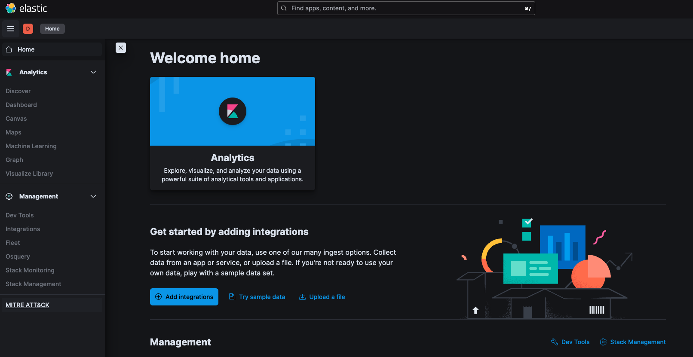
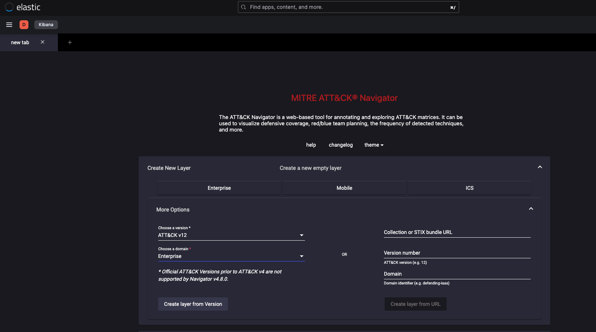
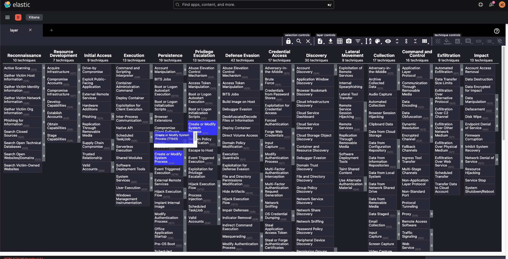

# MITRE ATT&CK Kibana Plugin

[MITRE ATT&CK Navigator](https://github.com/mitre-attack/attack-navigator) Plugin for Kibana

Works with the most recent release of Kibana

## Install

`bin/kibana-plugin install https://github.com/tehbooom/mitre_attack/releases/download/v0.0.2/mitreAttack-v8.6.2.zip`

or

`bin/kibana-plugin install file:///mitreAttack-v8.6.2.zip`

## Usage

### Once installed simply log into Kibana and you will see a new kibana space called MITRE ATT&CK

### Then create a new layer or import one

### Use the navigator to plan your red/blue team exercise or visualize defense coverage!

## TODO

- [#8](https://github.com/tehbooom/mitre_attack/issues/8) Add pretty pictures
- [#9](https://github.com/tehbooom/mitre_attack/issues/9) Allow plugin to be used offline
- [#10](https://github.com/tehbooom/mitre_attack/issues/10) Create a layer based on ES query to a specific scenario, operation, or adversary

## License

The source code for this project is released under the GNU GPL v3 License
